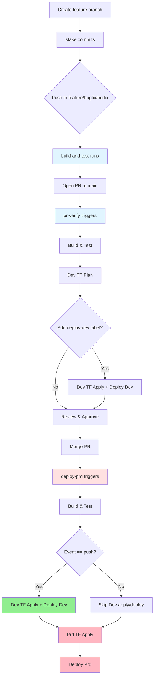

# Development Workflows

Target: Engineers working on platform-sitewatch-func (Azure Functions uptime checks). Covers branch strategy, CI/CD triggers, and label-driven deployment flows.

## Branch Strategy & Triggers

### Feature Development feature/*, bugfix/*, hotfix/*
- **build-and-test.yml**: Runs on push to feature/bugfix/hotfix branches
  - Build and test via `dotnet-func-ci` targeting .NET 9
  - No Terraform or deployments; fast feedback while iterating

### Pull Requests → main
- **pr-verify.yml**: Validation pipeline (runs on PR open/updates/reopen/label changes)
  - Build and test
  - Terraform plan for dev by default (skips drafts and dependabot)
  - Terraform plan+apply + deploy to dev when PR has `deploy-dev` label
  - Terraform plan for prd when PR has `run-prd-plan` label
  - Concurrency groups prevent parallel dev/prd plans and deployments

### Main Branch on merge
- **deploy-prd.yml**: Promotion pipeline
  - Build → Dev plan/apply → Deploy Dev (only on pushes to `main`)
  - Prd plan/apply → Deploy Prd (on push to `main`, weekly schedule Thu 3am UTC, or manual dispatch)
  - Prd steps tolerate skipped Dev deploys for scheduled/manual runs

### Scheduled & On-Demand
- **codequality.yml**: Weekly Monday 3am UTC + PR/push to main
  - SonarCloud analysis, DevOps secure scanning, dependency review (on PRs)
- **deploy-dev.yml**: Manual dispatch
  - Build → Dev plan/apply → Deploy Dev
- **destroy-development.yml** / **destroy-environment.yml**: Manual destroys for dev or targeted environments

## Standard Developer Flow

### Local Development
```bash
# Standard validation sequence
cd src/MX.Platform.SiteWatch.App
dotnet clean
dotnet build
dotnet test --filter "FullyQualifiedName!~IntegrationTests"
```

### Feature Branch → PR → Merge Flow



## Copilot & Label Guidance

- `deploy-dev` label: runs Terraform plan+apply for Development and deploys the function app to dev during PR validation.
- `run-prd-plan` label: runs Terraform plan for Production during PR validation.
- Draft PRs and dependabot PRs skip Terraform actions.

## Composite Actions (frasermolyneux/actions)

- **dotnet-func-ci**: Build and test the function app.
- **terraform-plan** / **terraform-plan-and-apply**: Init, plan, and optionally apply Terraform.
- **deploy-function-app**: Deploy Azure Function Apps from build artifacts.

## Quick Reference

| Scenario           | Workflow       | Trigger                  | Terraform     | Deploy  |
| ------------------ | -------------- | ------------------------ | ------------- | ------- |
| Feature commit     | build-and-test | Push to feature/bugfix   | ❌            | ❌       |
| PR validation      | pr-verify      | PR to main               | Dev plan      | Optional dev (label) |
| Merge to main      | deploy-prd     | Push to main             | Dev+Prd apply | Dev+Prd |
| Weekly maintenance | deploy-prd     | Thursday 3am UTC         | Prd apply     | Prd     |
| Manual dev refresh | deploy-dev     | Manual dispatch          | Dev apply     | Dev     |
| Code quality       | codequality    | Monday 3am UTC + PR/push | ❌            | ❌       |

## Environment Secrets

OIDC authentication uses GitHub environment variables (not repository secrets):
- `AZURE_CLIENT_ID`: Service principal app ID
- `AZURE_TENANT_ID`: Azure AD tenant
- `AZURE_SUBSCRIPTION_ID`: Target subscription

Defined in **Development** and **Production** environments within GitHub repository settings.
